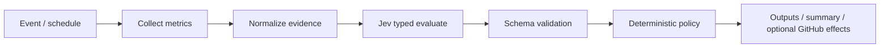

# JEV Resource RightSizer

Recommend **scale-down**, **keep**, **scale-up**, or **review** from resource metrics using typed [TypeSafe Jev](https://typesafe.ai) decisions in GitHub Actions.

This action **never changes infrastructure**. It collects evidence, asks Jev for a typed recommendation, validates the answer against a strict schema, then applies a deterministic policy. The only side effects are Action outputs, job summary, optional PR comment/labels, and optional check runs.

## Problem

Teams guess at instance and container sizes. Underutilized fleets waste money; saturated fleets cause incidents. You need a CI-friendly gate that turns CPU, memory, network, disk, request, and cost signals into a stable recommendation — without letting model prose mutate cloud resources.

## How it works



1. Load normalized JSON/YAML and/or connectors (CloudWatch, Azure Monitor, GCP Monitoring, Prometheus).
2. Aggregate utilization signals and factual reason codes.
3. Call Jev through a configurable provider (`vercel-ai-gateway` by default) with `experimental_evaluate`.
4. Reject invalid answers; map unavailability to provisional `review`.
5. Enforce confidence, completeness, and fail-* policies in code — not in free text.

## Quick start

```yaml
- uses: JevForge/jev-resource-rightsizer@v0
  with:
    metrics_path: examples/metrics.json
    environment: production
  env:
    AI_GATEWAY_API_KEY: ${{ secrets.AI_GATEWAY_API_KEY }}
```

See [`examples/`](examples/) for PR gates, CloudWatch, and Prometheus workflows.

## Recommendations

| Recommendation | Meaning |
| --- | --- |
| `scale-down` | Utilization is sustainably below thresholds |
| `keep` | Current size fits observed load |
| `scale-up` | Sustained saturation / pressure |
| `review` | Mixed, sparse, spiky, or low-confidence signals |

## Architecture

- **Collectors** normalize metrics into `ResourceEvidence` (never drop series silently).
- **Jev providers** share one contract: `vercel-ai-gateway`, `typesafe-native`, `custom-compatible`. No silent provider fallback.
- **Policy** can tighten `scale-down` / `scale-up` to `review`, fail the job, warn, or no-op — but cannot invent infrastructure commands.
- **Executor allowlist**: `set-outputs`, `write-summary`, `pull-request-comment`, `check-run`, `apply-labels`, `fail-workflow`.

## Inputs (high level)

| Input | Required | Default | Notes |
| --- | --- | --- | --- |
| `metrics_path` / `metrics_json` | one source* | — | Normalized metrics |
| `environment` | no | `production` | Affects reason codes |
| `scale_down_cpu_pct` / `scale_up_cpu_pct` | no | `20` / `75` | Thresholds |
| `cloudwatch_enabled` | no | `false` | AWS connector |
| `azure_enabled` | no | `false` | Azure Monitor |
| `gcp_enabled` | no | `false` | GCP Monitoring |
| `prometheus_enabled` | no | `false` | Prometheus |
| `jev_provider` | no | `vercel-ai-gateway` | Jev access path |
| `low_confidence_policy` | no | `fail` | `fail` \| `warn` \| `request-review` \| `no-op` |
| `dry_run` | no | `false` | Skip GitHub writes |

\*Or enable at least one connector.

Full input/output list: [`action.yml`](action.yml). Decision contract: [`docs/decision-contract.md`](docs/decision-contract.md). Connectors: [`docs/connectors.md`](docs/connectors.md).

## Outputs

- `recommendation`, `confidence`, `reason_codes`
- `supporting_metrics`, `resources`, `sources`
- `summary`, `explanation`, `provisional`
- optional `decision_json_path`, `sarif_path`

## Data sent to Jev

Sent: environment, observation window, thresholds, heuristic baseline, factual reason codes, per-resource metric aggregates (`avg` / `p95` / `p99` / `max` / sample counts), optional redacted resource ids, warnings.

Never sent: cloud credentials, API keys, GitHub tokens, raw secret-bearing labels, shell/Terraform/kubectl commands.

## Permissions

```yaml
permissions:
  contents: read
  checks: write          # create_check_run
  pull-requests: write   # comment_on_github / apply_labels
```

## Security

- Strict Zod schemas reject unknown recommendation values.
- Arbitrary Jev text is never executed.
- Resource ids can be hashed (`redact_resource_names`, default `true`).
- Connector URLs for custom Jev and Prometheus require HTTPS (localhost allowed for Prometheus only).

See [`SECURITY.md`](SECURITY.md).

## Development

```bash
npm ci
npm run all   # typecheck + coverage + build
```

Node 24+, TypeScript, Vitest, esbuild bundle to `dist/index.js`.

## License

MIT © JevForge
