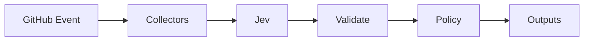

# JEV Resource RightSizer

[](https://github.com/JevForge/jev-resource-rightsizer/releases)
[](LICENSE)
[](https://github.com/marketplace/actions/jev-resource-rightsizer)
[](https://github.com/JevForge/jev-resource-rightsizer/actions/workflows/ci.yml)

**Recommend scale-down, keep, scale-up, or review from resource metrics** using [TypeSafe Jev](https://vercel.com/ai-gateway/models/jev) as a typed decision layer inside GitHub Actions.

Teams often guess at instance and container sizes. Underutilized fleets waste money; saturated fleets cause incidents. This Action turns CPU, memory, network, disk, request, and cost signals into a **stable recommendation** your workflow can branch on — without letting model prose resize infrastructure.

```yaml
- id: size
  uses: JevForge/jev-resource-rightsizer@v0.1.12
  env:
    AI_GATEWAY_API_KEY: ${{ secrets.AI_GATEWAY_API_KEY }}
  with:
    metrics_path: ops/metrics.json
    environment: production
```

> **Safety:** This Action **never changes infrastructure**. Side effects are limited to Action outputs, the job summary, and optional PR comment / labels / check runs.

## Features

* Typed rightsizing recommendations powered by Jev (`experimental_evaluate`, not free-form generation)
* Normalized JSON/YAML metrics, plus optional CloudWatch, Azure Monitor, GCP Monitoring, and Prometheus connectors
* Secret-based Jev authentication (`AI_GATEWAY_API_KEY`, `TYPESAFE_API_KEY`, or `JEV_CUSTOM_API_KEY`)
* Structured outputs for later steps (`recommendation`, `confidence`, `reason_codes`, …)
* Deterministic schema + confidence policy; Jev prose is never executed as a command
* Configurable low-confidence policy: `fail` | `warn` | `request-review` | `no-op`
* Optional dry-run mode that skips mutating GitHub writes
* Resource ids redacted by default before calling Jev

## How it works

```text
GitHub Event / schedule
        ↓
Collect metrics (JSON and/or connectors)
        ↓
Normalize + factual reason codes
        ↓
Jev typed evaluate (scale-down | keep | scale-up | review)
        ↓
Schema validation + deterministic policy
        ↓
Action outputs (+ optional comment / labels / check)
        ↓
Next CI/CD step
```



1. Load normalized metrics and/or enabled connectors.
2. Aggregate utilization signals and factual reason codes (never drop metric series silently).
3. Call Jev through `jev_provider` (no silent provider fallback).
4. Validate the typed answer; map unavailability to provisional `review`.
5. Apply confidence / completeness / `fail_on_*` policies in code.
6. Emit outputs. Free-form explanation text is display-only.

## Demo

```text
Exported metrics: cpu avg 11%, memory avg 24%, requests 0.4/s
        ↓
Jev → recommendation = scale-down
      confidence = 0.91
      reason_codes = ["CPU_UNDERUTILIZED","MEMORY_UNDERUTILIZED",…]
        ↓
Workflow opens a ticket / posts a PR comment
(infrastructure is NOT resized by this Action)
```

## Quick Start

1. Add a metrics file (see [`examples/metrics.json`](examples/metrics.json)).
2. Create repository secret `AI_GATEWAY_API_KEY` (default Jev provider).
3. Add a workflow step:

```yaml
name: Resource RightSizer
on:
  workflow_dispatch:

permissions:
  contents: read

jobs:
  rightsizing:
    runs-on: ubuntu-latest
    steps:
      - uses: actions/checkout@v4

      - id: size
        uses: JevForge/jev-resource-rightsizer@v0.1.12
        env:
          AI_GATEWAY_API_KEY: ${{ secrets.AI_GATEWAY_API_KEY }}
        with:
          metrics_path: examples/metrics.json
          environment: production
          create_check_run: 'false'

      - name: Use recommendation
        run: |
          echo "recommendation=${{ steps.size.outputs.recommendation }}"
          echo "confidence=${{ steps.size.outputs.confidence }}"
          echo "summary=${{ steps.size.outputs.summary }}"
```

Pin `@v0.1.12` for reproducibility, or `@v0` for the floating major line.

## Complete Example

PR gate with comment, labels, artifact, and conditional follow-up:

```yaml
name: PR rightsizing gate
on:
  pull_request:

permissions:
  contents: read
  checks: write
  pull-requests: write

jobs:
  rightsizing:
    runs-on: ubuntu-latest
    steps:
      - uses: actions/checkout@v4

      - id: size
        uses: JevForge/jev-resource-rightsizer@v0.1.12
        env:
          AI_GATEWAY_API_KEY: ${{ secrets.AI_GATEWAY_API_KEY }}
        with:
          metrics_path: ops/metrics.json
          comment_on_github: 'true'
          apply_labels: 'true'
          decision_json_path: rightsizing-decision.json

      - name: Upload decision
        uses: actions/upload-artifact@v4
        with:
          name: rightsizing-decision
          path: rightsizing-decision.json

      - name: Flag scale-up pressure
        if: steps.size.outputs.recommendation == 'scale-up'
        run: echo "Sustained saturation — review capacity before merge"

      - name: Flag waste
        if: steps.size.outputs.recommendation == 'scale-down'
        run: echo "Underutilized — candidate for rightsizing ticket"

      - name: Needs human review
        if: steps.size.outputs.recommendation == 'review' || steps.size.outputs.provisional == 'true'
        run: echo "Mixed or incomplete signals — do not auto-act"
```

More workflows: [`examples/basic.yml`](examples/basic.yml), [`examples/pr-gate.yml`](examples/pr-gate.yml), [`examples/cloudwatch.yml`](examples/cloudwatch.yml).

## Recommendations

| Recommendation | Meaning |
| --- | --- |
| `scale-down` | Utilization is sustainably below thresholds |
| `keep` | Current size fits observed load |
| `scale-up` | Sustained saturation / pressure |
| `review` | Mixed, sparse, spiky, provisional, or low-confidence signals |

## Inputs

| Input | Required | Default | Description |
| ----- | -------- | ------- | ----------- |
| `metrics_path` | no* | — | Workspace-relative normalized metrics JSON/YAML |
| `metrics_json` | no* | — | Inline normalized metrics JSON (do not combine with `metrics_path`) |
| `environment` | no | `production` | `production` \| `staging` \| `development` \| `sandbox` \| `other` |
| `window_start` / `window_end` | no | last 7 days → now | Observation window (ISO-8601) |
| `scale_down_cpu_pct` | no | `20` | CPU % at/below which scale-down is evidenced |
| `scale_up_cpu_pct` | no | `75` | CPU % at/above which scale-up is evidenced |
| `scale_down_memory_pct` | no | `30` | Memory % scale-down threshold |
| `scale_up_memory_pct` | no | `80` | Memory % scale-up threshold |
| `min_sample_count` | no | `12` | Samples required for a strong signal |
| `spike_ratio` | no | `2.5` | `max/avg` spike ratio that forces review |
| `threshold_profile` | no | environment-aware | `conservative` \| `balanced` \| `aggressive` preset; explicit thresholds override the preset |
| `cloudwatch_enabled` | no | `false` | Query AWS CloudWatch |
| `cloudwatch_namespace` | no | — | e.g. `AWS/EC2` |
| `cloudwatch_metric_name` | no | — | e.g. `CPUUtilization` |
| `cloudwatch_metric_names` | no | — | Comma/newline metric names for batch collection |
| `cloudwatch_dimensions` | no | — | `Name=Value` pairs or JSON array |
| `cloudwatch_resource_id` | no | — | Stable id for outputs |
| `cloudwatch_resource_ids` | no | — | Comma/newline resource ids for batch collection |
| `azure_enabled` | no | `false` | Query Azure Monitor |
| `azure_resource_id` | no | — | Full Azure resource id |
| `azure_resource_ids` | no | — | Comma/newline full Azure resource ids |
| `azure_metric_names` | no | `Percentage CPU` | Comma/newline metric names |
| `gcp_enabled` | no | `false` | Query GCP Monitoring |
| `gcp_project_id` / `gcp_metric_type` / `gcp_resource_id` | no | — | GCP query target |
| `gcp_metric_types` / `gcp_resource_ids` | no | — | Comma/newline GCP batch query targets |
| `prometheus_enabled` | no | `false` | Query Prometheus `query_range` |
| `prometheus_url` | no | — | HTTPS base URL (localhost allowed) |
| `prometheus_resource_id` | no | — | Stable id for outputs |
| `prometheus_resource_ids` | no | — | Comma/newline ids from Prometheus result labels |
| `prometheus_queries_path` | no | — | YAML/JSON query list |
| `include_resources` | no | — | Comma/newline globs for resource id, service, or resource kind to include |
| `exclude_resources` | no | — | Comma/newline globs for resource id, service, or resource kind to exclude |
| `min_confidence` | no | `0.75` | Minimum confidence for scale-down/up |
| `low_confidence_policy` | no | `fail` | `fail` \| `warn` \| `request-review` \| `no-op` |
| `allow_partial` | no | `false` | Allow scale decisions with partial metrics |
| `allow_insufficient` | no | `false` | Allow scale decisions with weak samples |
| `fail_on_review` | no | `false` | Fail the job when recommendation is `review` |
| `fail_on_scale_up` / `fail_on_scale_down` | no | `false` | Fail the job on those recommendations |
| `redact_resource_names` | no | `true` | Hash resource ids before Jev / in outputs |
| `jev_provider` | no | `vercel-ai-gateway` | Jev access path (not a metrics connector) |
| `jev_endpoint` | no | — | HTTPS evaluate endpoint (native/custom) |
| `jev_model` | no | — | Required for native/custom; Gateway default `typesafe-ai/jev` |
| `timeout_ms` | no | `45000` | Jev timeout |
| `connector_timeout_ms` | no | `20000` | Connector timeout |
| `comment_on_github` | no | `false` | Post/update PR comment |
| `apply_labels` | no | `false` | Apply managed `jev:rightsizing:*` labels |
| `create_check_run` | no | `true` | Create Check Run on head SHA |
| `dry_run` | no | `false` | Skip mutating GitHub writes |
| `decision_json_path` | no | — | Write full decision JSON |
| `sarif_path` | no | — | Write SARIF 2.1 report |
| `github_token` | no | `${{ github.token }}` | For comments / labels / checks |

\*Provide `metrics_path`, `metrics_json`, and/or enable at least one connector.

Full metadata: [`action.yml`](action.yml). Connectors: [`docs/connectors.md`](docs/connectors.md). Decision contract: [`docs/decision-contract.md`](docs/decision-contract.md).

## Outputs

| Output | Description |
| ------ | ----------- |
| `recommendation` | `scale-down` \| `keep` \| `scale-up` \| `review` |
| `confidence` | `0`–`1` |
| `reason_codes` | JSON array of stable reason codes |
| `summary` | One-line log summary |
| `explanation` | Display-only explanation (never executed) |
| `provisional` | `true` when Jev did not return a usable typed decision |
| `environment` | Environment used for the decision |
| `resource_count` | Number of resources evaluated |
| `primary_resource_id` | Primary resource id (possibly redacted), or empty |
| `supporting_metrics` | JSON metric series supporting the recommendation |
| `resources` | JSON of every resource and metrics (never dropped) |
| `sources` | JSON metric source ids |
| `partial_count` | Count of partial metric series |
| `insufficient_count` | Count of weak/insufficient series |
| `heuristic_recommendation` | Deterministic baseline before Jev |
| `per_resource_recommendations` | JSON array with a deterministic recommendation, reasons, and exclusion flag per resource |
| `threshold_profile` | Selected threshold preset used to resolve defaults |
| `cost_hourly` | Aggregated hourly cost signal, if present |
| `cost_monthly` | Aggregated monthly cost signal or a 730-hour projection |
| `cost_impact` | JSON estimate using a 20% reduction/increase factor; `null` without cost or scale recommendation |
| `decision_json_path` | Path written when requested, else empty |
| `sarif_path` | Path written when requested, else empty |

### Using outputs in conditions

```yaml
- name: Open capacity review
  if: steps.size.outputs.recommendation == 'scale-up'
  run: echo "Recommend capacity increase"

- name: Open waste ticket
  if: steps.size.outputs.recommendation == 'scale-down'
  run: echo "Recommend scale-down review"

- name: Keep current size
  if: steps.size.outputs.recommendation == 'keep'
  run: echo "No change indicated"

- name: Human review required
  if: steps.size.outputs.recommendation == 'review'
  run: echo "Do not auto-apply a size change"
```

## Authentication

Create a repository secret:

```text
Repository → Settings → Secrets and variables → Actions → New repository secret
```

| `jev_provider` | Secret name | Notes |
| -------------- | ----------- | ----- |
| `vercel-ai-gateway` (default) | `AI_GATEWAY_API_KEY` | AI SDK `experimental_evaluate` + `typesafe-ai/jev` |
| `typesafe-native` | `TYPESAFE_API_KEY` | Requires `jev_endpoint` + `jev_model` |
| `custom-compatible` | `JEV_CUSTOM_API_KEY` | Requires HTTPS `jev_endpoint` + `jev_model` |

Optional connector secrets (only when that connector is enabled): AWS credential chain, `AZURE_*`, `GCP_ACCESS_TOKEN`, `PROMETHEUS_BEARER_TOKEN`.

**Never** put API keys in workflow YAML, logs, or Issues. There is **no silent fallback** between Jev providers.

Optional local overrides: [`examples/.jev/config.yml`](examples/.jev/config.yml) (Action inputs override file values).

## Why JEV?

Jev is TypeSafe’s evaluation model for **structured decisions**, not chat. Rightsizing needs a choice among `scale-down` | `keep` | `scale-up` | `review`, plus confidence and incompleteness signals. Jev returns typed answers (`choice` / `boolean`) that this Action validates with Zod. Generative text would be unsafe to treat as a shell, Terraform, kubectl, or cloud API command — so the Action uses `experimental_evaluate` and never `generateText` for the decision. A deterministic policy then enforces thresholds and low-confidence behavior in code.

## Data Sent to JEV

Sent:

* environment, observation window, thresholds
* heuristic baseline recommendation and factual reason codes
* per-resource metric aggregates (`avg` / `p95` / `p99` / `max` / sample counts)
* optionally redacted resource ids
* warnings from collectors

Never sent: cloud credentials, API keys, GitHub tokens, shell/Terraform/kubectl commands, or raw secret-bearing blobs.

## Permissions

Outputs only:

```yaml
permissions:
  contents: read
```

Comments, labels, and Check Runs:

```yaml
permissions:
  contents: read
  pull-requests: write
  checks: write
```

Do **not** grant cloud write permissions to this job for rightsizing — the Action cannot (and must not) mutate infrastructure.

## Security

* Strict Zod schemas reject unknown recommendation values.
* Arbitrary Jev text is never executed.
* Resource ids are hashed by default (`redact_resource_names: true`).
* Custom Jev endpoints and Prometheus URLs require HTTPS (localhost allowed for Prometheus only).
* Secrets are redacted from error strings before logging.

See [`SECURITY.md`](SECURITY.md).

## Versioning

```yaml
uses: JevForge/jev-resource-rightsizer@v0.1.12   # recommended pin
uses: JevForge/jev-resource-rightsizer@v0       # floating major (v0.x)
```

### Cutting a release (CI)

1. Merge to `main` with `dist/` up to date (`npm run build`).
2. Either **Actions → Release → Run workflow** on `main` (enter the next version), or push its `vX.Y.Z` tag.
3. [`jev-release-forge`](https://github.com/JevForge/jev-release-forge) verifies the build, publishes the GitHub Release, and moves floating major `v0`.

Marketplace listing updates still need one browser step (GitHub 2FA): edit the release and keep **Publish this Action to the GitHub Marketplace** checked.

See [CHANGELOG.md](CHANGELOG.md) and [Releases](https://github.com/JevForge/jev-resource-rightsizer/releases).

## Development

Requires Node.js 24+.

```bash
npm ci
npm run all   # typecheck + coverage + build
```

Consumers run bundled `dist/index.js` (`runs.using: node24`) and do not need to install dependencies.

The provider mock smoke check can be run locally with `npm run build` followed by
`node scripts/smoke-e2e.mjs`; CI exposes the same check as a `workflow_dispatch`
workflow.

## Contributing

See [CONTRIBUTING.md](CONTRIBUTING.md). Report bugs via Issues — **never** include API keys, tokens, or credentials.

## Security

See [SECURITY.md](SECURITY.md).

## License

MIT © JevForge
